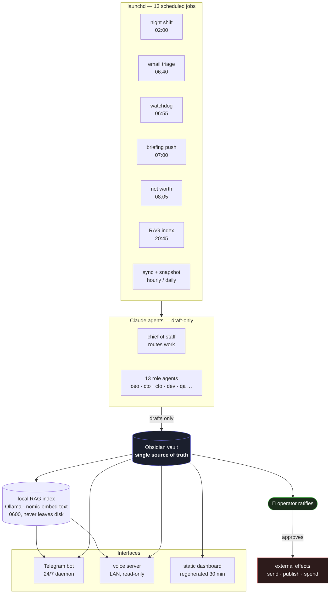

# 🧠 Jarvis

**A personal AI-operations system that runs unattended on macOS.**

Thirteen scheduled jobs, a local RAG index over a private Obsidian vault, a Telegram bot, a
voice endpoint, and a multi-agent night shift — all coordinated around one hard rule:
**nothing autonomous ever sends, spends, deploys, or publishes.** Agents produce drafts; a
human ratifies them.

This is production-shaped personal infrastructure, not a demo. It has been running daily
since July 2026, has survived (and been hardened by) several real multi-day outages, and
every design decision is written down with its rejected alternatives in
[`DECISIONS.md`](DECISIONS.md).

---

## Architecture



The vault is the brain; this repo is the hands. Product decisions live in the vault, code
lives here, and the two never merge.

---

## Engineering highlights

These are the decisions worth reading the code for. Full reasoning, including what was
rejected and why, is in [`DECISIONS.md`](DECISIONS.md).

**Prompt-injection containment.** Email bodies are attacker-controlled text. The triage job
classifies them with a single-turn model call holding **zero tools** (`--tools ''`,
`--strict-mcp-config`) and opens IMAP read-only (`BODY.PEEK`, readonly `SELECT`) — so it is
incapable of sending, deleting, or moving mail at the protocol level. A capability that does
not exist cannot be exploited by a clever message.

**Knowing when not to use an LLM.** The daily briefing was originally model-composed. It is
now assembled by a deterministic, stdlib-only builder that copies every number from a source
file. Reason: a model can hallucinate a habit streak or a deadline count, a `for` loop
cannot — and the builder is unit-testable, free, and instant. The model kept the jobs that
actually need judgment.

**Alerting that survives the outage it reports.** The watchdog originally checked only
whether each job's label appeared in `launchctl list`. A crash-looping job still shows its
label, so the watchdog reported "all healthy" straight through a two-day outage. It now
parses PID and exit-status columns and pushes critical failures directly to Telegram —
because both prior outages were invisible precisely because the alert channel was itself
one of the broken jobs. An off-machine dead-man switch backstops even that.

**Dormant vs. broken as an exit-code contract.** An unconfigured feature exits `0` and stays
silent; a configured-but-failing feature exits `1` and the watchdog escalates. The exit code
carries intent, so optional features can ship disabled without generating permanent noise.

**Marker-managed writes into human-edited files.** The finance tracker maintains exactly the
region between two HTML comment markers in a file the operator writes by hand, replacing it
by string slice so every byte outside the markers survives verbatim — and writing nothing at
all until the first successful ingest, so a failed run can never blank the block.

**Measured retrieval, not assumed retrieval.** `rag_eval.py` scores the RAG pipeline
against a 20-question golden set of real vault questions with known source notes, reporting
hit@1/3/5 and MRR. The first run was not flattering — **MRR 0.40, hit@5 11/20** — which is
the point: a chunking or model change now moves a number instead of a feeling. Two design
notes: nDCG and MAP are deliberately skipped as noise-dominated at n=20, and a failed CLI
call is recorded as a failed *measurement* rather than graded as a wrong answer, so a flaky
invocation can never quietly depress the trend line.

**Omit over placeholder.** Every unavailable data source drops its entire line rather than
rendering "N/A" or "0 pending". Eight real lines beat fifteen padded ones.

---

## What runs

| Job | Schedule | What it does |
|---|---|---|
| `telegrambot` | always on | Answers from the vault; `/task` `/brief` `/search` `/status` |
| `nightshift` | 02:00 | Headless chief-of-staff works ≤3 backlog items, draft-only → shift report + decision inbox |
| `emailtriage` | 06:40 | Read-only IMAP → classify needs-reply / FYI / noise → reply drafts for ratification |
| `watchdog` | 06:55 | Verifies every job ran; escalates critical failures; pings external dead-man switch |
| `briefingpush` | 07:00 | Deterministic ≤15-line commander brief → Telegram |
| `networth` | 08:05 | Parses bank CSVs via per-bank column mappings → marker-managed block in goals file |
| `dashboard` | every 30 min | Self-contained static HTML — inline CSS, SVG sparklines, no CDN, works offline |
| `ragindex` | 20:45 | Embeds every vault note locally via Ollama → `~/.jarvis-rag/` |
| `rageval` | Sun 19:00 | Scores retrieval against a golden set — hit@k and MRR, so RAG quality is a tracked number, not a vibe |
| `dailysync` | 21:00 | Pushes a curated file subset to a private remote |
| `marketradar` | 01:30 | Scrapes job postings → trend table in the vault |
| `vaultsnapshot` | hourly | Commits the vault to a **bare local** git repo — never leaves the machine |
| `weeklysync` | Sun 18:05 | Git activity + 7-day health digest → drafts a weekly review |
| `voiceserver` | always on | LAN HTTP for Siri Shortcuts — read-only by design |

## Layout

```
bin/        all executable jobs + night_shift_prompt.md (the shift's orders)
launchd/    plist SOURCES (versioned) — edit here, never ~/Library directly
config/     gitignored secrets; *.example templates are tracked
app/        Electron + React desktop client (voice-first, in progress)
install.sh  deploys launchd/*.plist and reloads them
```

---

## Setup

Requires macOS, Python 3.11+, [Ollama](https://ollama.com) (for RAG), and the
[Claude Code CLI](https://claude.com/claude-code).

```bash
git clone https://github.com/JayLakhani2002/jarvis.git
cd jarvis

# fill in the credentials you actually want; every feature is dormant without its config
cp config/telegram.conf.example config/telegram.conf
cp config/voice.conf.example    config/voice.conf

./install.sh          # deploys plists to ~/Library/LaunchAgents and loads them
launchctl list | grep jaysbrain   # exit code 0 == healthy
```

Every optional feature is **dormant until configured** and exits `0` — you can run this with
only a Telegram token and add the rest later.

> **Note:** absolute paths are currently hardcoded (see *Known limitations* below), so this
> expects to live at `~/Documents/Projects/Jarvis`. Cloning elsewhere requires a
> find-and-replace first.

---

## Security

Autonomous agents, untrusted input, and private data in one system — the model is written
out in full in [`SECURITY.md`](SECURITY.md). Summary:

- **No unattended process can send, spend, deploy, or push.** Enforced structurally, not by
  prompt instruction.
- **Untrusted input is processed by tool-less model calls only.**
- **`config/` has never been committed** — verifiable with the history scan in `SECURITY.md`.
- **Journals, health data, embeddings, and financial records never leave the machine.** The
  vault snapshot repo is bare and local; "private remote" was explicitly rejected as a
  substitute for "on this disk".

---

## Known limitations

Stated plainly, because the failures taught more than the successes:

- **Absolute paths are hardcoded** across the plists and several scripts. Moving the repo
  once broke every job silently for ten days — the watchdog that would have caught it was
  itself one of the broken jobs. This is why the external dead-man switch exists.
- **launchd log paths must stay outside `~/Documents`.** A stale TCC attribute on a log file
  under an iCloud-synced directory makes `posix_spawn` fail *before* exec, crash-looping the
  job with exit `78` while its label still appears healthy in `launchctl list`.
- **iCloud file eviction breaks background jobs.** Evicted (`dataless`) vault files cannot be
  materialized by a non-interactive process; the read fails with `EDEADLK`. Retry logic does
  not help — it is a refusal, not a transient lock.
- **The LAN voice endpoint is plain HTTP** with a shared-key check.
- **No CI.** Self-checks exist per script but are not yet run automatically.

## License

MIT — see [`LICENSE`](LICENSE).
